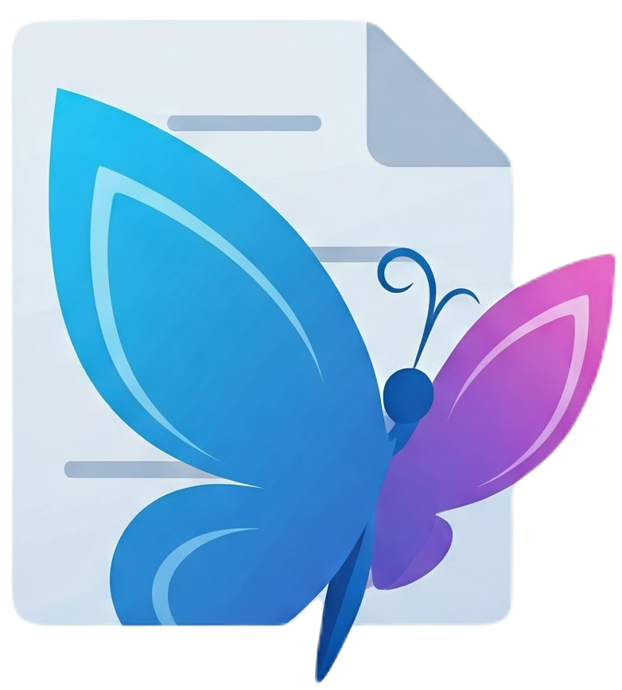

  

# SuperDoc Contributor License Agreement Summary

Thanks for contributing to SuperDoc. This Contributor License Agreement helps us accept community contributions while making sure the project has clear rights to use, maintain, distribute, and improve the code over time.

A few important points:

- **You still own your contribution.** This agreement does not transfer ownership of your code to SuperDoc.
- **You give SuperDoc permission to use your contribution.** This lets us include it in SuperDoc, maintain it, distribute it, and make it available under our open source and commercial licenses.
- **You only need to sign once.** After you accept the agreement, future contributions from the same GitHub account are covered.
- **Please only contribute work you have the right to submit.** If your employer may own your work, or if your contribution includes third-party code, please make sure you have permission before submitting it.
- **You do not have to support your contribution forever.** Once submitted, you are not responsible for ongoing maintenance unless you choose to help.

We use this agreement so SuperDoc can remain a healthy open source project and a reliable product for the companies and developers who depend on it.

If you have questions, contact us at [legal@superdoc.dev](mailto:legal@superdoc.dev).

This summary is provided for convenience only and is not intended to modify, limit, or replace the terms of the Contributor License Agreement below. If there is any conflict between this summary and the Contributor License Agreement, the Contributor License Agreement controls.

---

# SuperDoc Contributor License Agreement (Individuals)

**Agreement version:** 1.0

You accept and agree to the following terms and conditions for Your past, present, and future Contributions submitted to Company. Except for the license granted herein to Company and recipients of software distributed by Company, You reserve all right, title, and interest in and to Your Contributions.

**1. Definitions.**

"Company" means Harbour Enterprises, Inc., doing business as SuperDoc.

"You" (or "Your") shall mean the copyright owner or legal entity authorized by the copyright owner that is making this Agreement with Company. For legal entities, the entity making a Contribution and all other entities that control, are controlled by, or are under common control with that entity are considered to be a single Contributor. For the purposes of this definition, "control" means (i) the power, direct or indirect, to cause the direction or management of such entity, whether by contract or otherwise, or (ii) ownership of fifty percent (50%) or more of the outstanding shares, or (iii) beneficial ownership of such entity.

"Contribution" shall mean any original work of authorship, including any modifications or additions to an existing work, that is intentionally submitted by You to Company for inclusion in, or documentation of, any of the products owned or managed by Company (the "Work"). For the purposes of this definition, "submitted" means any form of electronic, verbal, or written communication sent to Company or its representatives, including but not limited to communication on electronic mailing lists, source code control systems, and issue tracking systems that are managed by, or on behalf of, Company for the purpose of discussing and improving the Work, but excluding communication that is conspicuously marked or otherwise designated in writing by You as "Not a Contribution."

**2. Grant of Copyright License.** Subject to the terms and conditions of this Agreement, You hereby grant to Company and to recipients of software distributed by Company a perpetual, worldwide, non-exclusive, no-charge, royalty-free, irrevocable copyright license to reproduce, prepare derivative works of, publicly display, publicly perform, sublicense, and distribute Your Contributions and such derivative works.

**3. Grant of Patent License.** Subject to the terms and conditions of this Agreement, You hereby grant to Company and to recipients of software distributed by Company a perpetual, worldwide, non-exclusive, no-charge, royalty-free, irrevocable (except as stated in this section) patent license to make, have made, use, offer to sell, sell, import, and otherwise transfer the Work, where such license applies only to those patent claims licensable by You that are necessarily infringed by Your Contribution(s) alone or by combination of Your Contribution(s) with the Work to which such Contribution(s) was submitted. If any entity institutes patent litigation against You or any other entity (including a cross-claim or counterclaim in a lawsuit) alleging that Your Contribution, or the Work to which You have contributed, constitutes direct or contributory patent infringement, then any patent licenses granted to that entity under this Agreement for that Contribution or Work shall terminate as of the date such litigation is filed.

**4.** You represent that You are legally entitled to grant the above license. If Your employer(s) has rights to intellectual property that You create that includes Your Contributions, You represent that You have received permission to make Contributions on behalf of that employer, that Your employer has waived such rights for Your Contributions to Company, or that Your employer has executed a separate Corporate Contributor License Agreement with Company.

**5.** You represent that each of Your Contributions is Your original creation (see Section 7 for submissions on behalf of others). You represent that Your Contribution submissions include complete details of any third-party license or any other restriction (including, but not limited to, related patents and trademarks, whether such patents or trademarks are Yours, Your employer's or any other party's) of which You are personally aware and which are associated with any part of Your Contributions. You further represent that Your Contributions do not include code, documentation, or other materials copied from third-party sources, generated or provided under terms that would restrict Company's use, distribution, sublicensing, or relicensing of the Contribution, or otherwise subject to license terms inconsistent with this Agreement, except as disclosed by You in writing.

**6.** You are not expected to provide support for Your Contributions, except to the extent You desire to provide support. You may provide support for free, for a fee, or not at all. UNLESS REQUIRED BY APPLICABLE LAW OR AGREED IN WRITING, YOU PROVIDE YOUR CONTRIBUTIONS ON AN "AS IS" BASIS, WITHOUT WARRANTIES OR CONDITIONS OF ANY KIND, EITHER EXPRESS OR IMPLIED, INCLUDING, WITHOUT LIMITATION, ANY WARRANTIES OR CONDITIONS OF TITLE, NON-INFRINGEMENT, MERCHANTABILITY, OR FITNESS FOR A PARTICULAR PURPOSE.

**7.** Should You wish to submit work that is not Your original creation, You may submit it to Company separately from any Contribution, identifying the complete details of its source and of any license or other restriction (including, but not limited to, related patents, trademarks, and license agreements) of which You are personally aware, and conspicuously marking the work as "Submitted on behalf of a third-party: \[named here\]".

**8.** You agree to notify Company of any facts or circumstances of which You become aware that would make these representations inaccurate in any respect.

**9. No Obligation to Use Contributions.** Company is not obligated to accept, use, publish, maintain, or include any Contribution.

**10.** You agree that Company may use, reproduce, modify, distribute, sublicense, and otherwise make available Your Contributions, and derivative works thereof, under any license terms Company chooses, including open source, free software, source-available, commercial, proprietary, or other license terms, without further permission from or payment to You.

**11. Waiver of Moral Rights.** To the maximum extent permitted by applicable law, You waive, and agree not to assert, any moral rights or similar rights in Your Contributions against Company, recipients of software distributed by Company, or their respective licensees, sublicensees, successors, or assigns. To the extent such rights cannot be waived, You agree not to exercise them in a manner that interferes with the licenses or rights granted under this Agreement.

**12. Governing Law.** This Agreement is governed by and construed in accordance with the laws of the State of California, without regard to its conflict of laws provisions. The parties agree that the state and federal courts located in San Francisco County, California will have exclusive jurisdiction over any dispute arising out of or relating to this Agreement, and each party consents to personal jurisdiction and venue in those courts.

**13. Assignment; Successors and Assigns.** Company may assign this Agreement and the licenses and rights granted herein, in whole or in part, without notice to or consent from You, including in connection with a merger, acquisition, corporate reorganization, financing, or sale of all or substantially all of Company's assets or of the assets relating to the Work. This Agreement will bind and inure to the benefit of the parties and their respective successors and permitted assigns, and the licenses granted by You are intended to survive and continue in full force for the benefit of any such successor or assign.

**14. Electronic Submission.** The simplest way to accept this Agreement is through our automated CLA assistant on GitHub. When you open your first pull request to a SuperDoc repository, the CLA assistant will post a comment with a link to this Agreement and the acceptance phrase to use. Follow the link, review the terms, and confirm your acceptance by replying to the pull request with that phrase. Your acceptance is recorded against your GitHub username, and you will only be asked once. Company may maintain records of Your electronic acceptance, including Your GitHub username, name, email address, timestamp of acceptance, version of this Agreement accepted, and related repository or organization information. Confirming electronically has the same legal effect as signing this Agreement by hand.

**Offline signing.** If you are unable to use the GitHub CLA assistant, email us at [legal@superdoc.dev](mailto:legal@superdoc.dev) and we will arrange an alternative way for you to sign.
