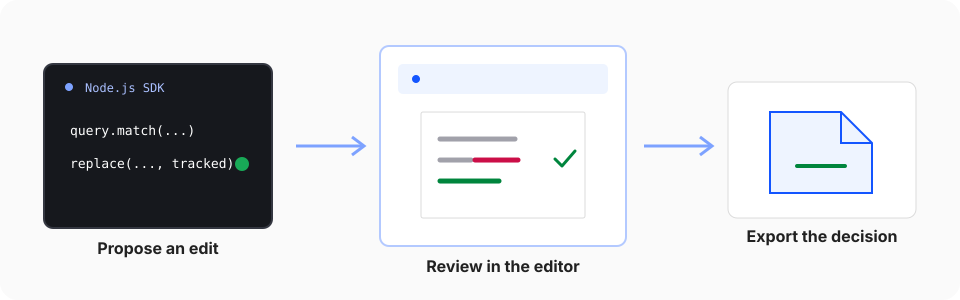

Use tracked changes when code or an agent should propose an edit without making the final decision. This workflow creates a reviewable DOCX with the Node.js SDK, opens that exact file in the editor, and keeps the final decision with a person.



## 1. Prepare the source document

Download the synthetic NDA and save it as `contract.docx`. It contains the word `termination` and one existing tracked change.

<FileDownload
  href='/fixtures/tracked-changes.docx'
  label='Download the tracked-changes fixture'
  description='Synthetic NDA with one tracked change'
  fileType='DOCX'
/>

Install the SDK in an empty Node.js project:

```bash
pnpm add @superdoc/sdk@latest
```

## 2. Create a tracked replacement

Create `propose-change.mjs` next to `contract.docx`:

<include>../../../../snippets/headless/propose-change.mjs</include>

The query returns a document-native target. Passing that target to `replace()` avoids deriving an edit location from rendered HTML or copied character offsets. `changeMode: 'tracked'` records the replacement as a suggestion. The resolved operation result contains receipt information for inspection. Check it before saving in production workflows.

<ReceiptBar operation='replace' detail='replacement recorded in tracked mode' />

## 3. Produce the review file

Run the script:

```bash
node propose-change.mjs
```

The script writes `contract.suggested.docx` and leaves `contract.docx` unchanged. Saving to a separate path does not overwrite the open source session, so the final close explicitly discards the in-memory working state after the output is safely written.

<Callout variant='success' title='Automation checkpoint'>
  Open `contract.suggested.docx` and confirm that the heading shows a tracked replacement from `Termin` to `cancell`.
  Accepting that change should make the complete word read `cancellation`.
</Callout>

## 4. Review the exact output

Select **Open your DOCX** below and choose `contract.suggested.docx`. The file opens locally in the browser. The documentation site does not upload it.

<EditorDemo
  allowLocalFile
  fixture='/fixtures/tracked-changes.docx'
  preset='tracked-review'
  title='Review the suggested DOCX'
/>

Use the editor review controls to accept or reject each tracked change. The sample document is always available if you want to inspect the review experience before running the script.

## 5. Export the decision

Export the reviewed document as DOCX. Reopen it in Word or SuperDoc and verify that the accepted text remains, rejected text is restored, and the surrounding formatting is intact.

<Callout variant='success' title='Verification target'>
  The final DOCX should reflect the reviewer’s decisions. The original source and the proposed review file should remain
  available as separate artifacts.
</Callout>

The same query, target, mutation, and receipt contract works in both hosts. Read the [Document API mental model](/document-api/mental-model) for the boundary behind this workflow.
