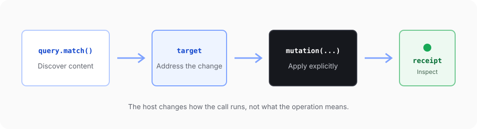

The Document API is the operation contract for reading and changing a SuperDoc document. Browser and headless hosts expose the same operation names and data shapes.

Most workflows follow four steps:

1. Query the document.
2. Keep the returned address or target.
3. Apply a mutation to that target.
4. Inspect the mutation receipt.



## 1. Query

Use `doc.query.match(...)` to find content by meaning or structure. A query returns document-native references for the next step.

Follow [Query document content](/document-api/query-content) for a complete browser example and the result fields to keep.

<RuntimeExampleTabs>
  <RuntimeExample runtime='Browser'>
    ```ts
    const match = await editor.doc.query.match({
      select: { type: 'text', pattern: 'termination' },
      require: 'first',
    });

    const result = match.items[0];
    if (!result || result.matchKind !== 'text') {
      throw new Error('No matching text found.');
    }

    const operation = await editor.doc.replace({
      target: result.target,
      text: 'cancellation',
    }, { changeMode: 'tracked' });
    ```

  </RuntimeExample>
  <RuntimeExample runtime='Headless'>
    ```ts
    const match = await doc.query.match({
      select: { type: 'text', pattern: 'termination' },
      require: 'first',
    });

    const result = match.items[0];
    if (!result || result.matchKind !== 'text') {
      throw new Error('No matching text found.');
    }

    const operation = await doc.replace({
      target: result.target,
      text: 'cancellation',
      changeMode: 'tracked',
    });
    ```

  </RuntimeExample>
</RuntimeExampleTabs>

Do not derive mutation locations from rendered DOM nodes or copied text offsets. The DOM can change when layout changes. A Document API result belongs to the document model.

## 2. Address or target

An address identifies a document location or object. A target describes the content a mutation should affect. Some query results provide a mutation-ready target. Other workflows resolve an address into the target required by the operation.

Keep the target returned for the current document revision. If the document changes first, query again instead of assuming that an old target still points to the same content.

## 3. Mutate

Pass the target to the operation that makes the change. The target makes the scope explicit. It also lets each host apply the same operation contract without inspecting its UI state.

Tracked-change review follows this shape. `doc.trackChanges.list()` discovers changes. `doc.trackChanges.get()` reads one change. `doc.trackChanges.decide({ decision, target })` applies a decision to an explicit target.

## 4. Receipt

A successful mutation returns a receipt that records what the engine applied. Use it to confirm the result and continue from the resolved effects.

Treat the receipt as part of the contract. Do not infer success from a repaint, a changed file size, or the absence of an error.

<ReceiptBar operation='replace' detail='replacement recorded in tracked mode' />

## Runtime shape

Browser calls are Promise-shaped. Other clients expose their own synchronous or asynchronous form. The operation names, inputs, outputs, targets, errors, and receipt meaning stay the same.

This separation is deliberate. The host decides how a call runs. The Document API decides what the call means.

## Use the contract in a workflow

<Cards>
  <Card
    title='Mount an editor'
    description='Open a DOCX, make a tracked edit, and export the result in a browser application.'
    href='/editor/quickstart'
  />
  <Card
    title='Run a headless operation'
    description='Query a DOCX, accept its tracked changes, and save a separate output from Node.js.'
    href='/agents/automation/node-sdk'
  />
  <Card
    title='Connect code to human review'
    description='Create a tracked replacement, review the exact output in the editor, and export the decision.'
    href='/agents/workflows/review-tracked-changes'
  />
</Cards>

## Reference

The [generated Document API reference](/document-api/reference) is derived from the canonical public contract and lists the current operations, inputs, outputs, and failure modes.
