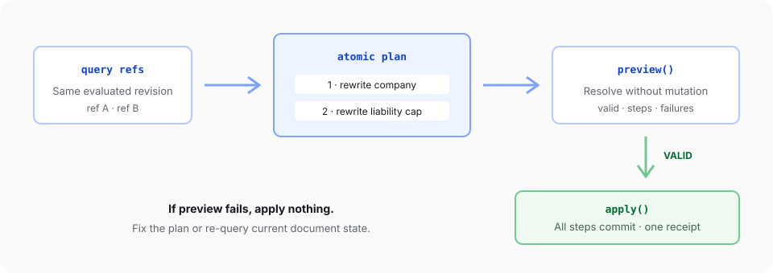

Use a mutation plan when several edits belong to one logical change. A plan resolves every target, previews the combined work without changing the document, and applies valid steps as one atomic transaction.

For one independent replacement or deletion, prefer the direct operations in [Replace and delete content](/document-api/replace-delete-content).

## Run a complete browser example

Create a browser app with an `#editor` mount element and an explicit container height, as shown in the [Editor quickstart](/editor/quickstart). This example expects the [tracked-changes fixture](/fixtures/tracked-changes.docx) at `/contract.docx`. Its source lives in the docs app and is typechecked against the public v2 browser API:

<include>../../../snippets/document-api/mutation-plans.ts</include>

The example queries both targets before applying any change. It also confirms that both matches came from the same document revision before building the plan.

## Build the plan from references

Use `item.handle.ref` for plan steps. Each ref points to content resolved by `query.match()`, and `expectedRevision` binds the plan to the document state that produced those refs.

Every plan requires:

- `atomic: true`
- `changeMode: 'direct'` or `'tracked'`
- A stable, unique `id` for every step
- A supported step `op`
- A `where` target and operation-specific `args`

Check `doc.capabilities().planEngine.supportedStepOps` before constructing plans dynamically. The generated reference remains authoritative for each step shape.

## Preview without changing the document

`doc.mutations.preview(plan)` resolves targets and validates every step without applying document changes.

Read:

- `valid` before calling `apply()`
- `failures` for the step ID, phase, code, and message
- `steps` for the targets each step resolved
- `evaluatedRevision` for the state used during preview

A valid preview is still a snapshot. Another writer can change the document before apply, so keep `expectedRevision` on the plan.

## Apply atomically

`doc.mutations.apply(plan)` commits every step together. If compilation, target resolution, an assertion, or revision validation fails, the plan does not partially apply successful steps.

The returned plan receipt includes the before/after revision, a result for every step, any tracked-change addresses, and timing metadata. Use step results for verification and diagnostics, not for inventing performance claims.

<Callout variant='success' title='Verification target'>
  The preview should report `valid: true`. Apply should return two changed steps, and the Editor should show `Northstar
  Corp` plus a `$250,000` liability cap as tracked changes.
</Callout>

The generated [`mutations.preview` reference](/document-api/reference/mutations/preview) and [`mutations.apply` reference](/document-api/reference/mutations/apply) list supported steps, limits, outputs, and failure codes.
