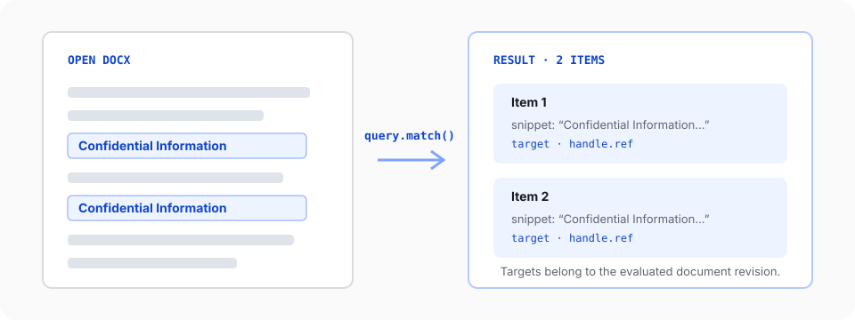

Use `doc.query.match()` when code needs to locate document content before reading or changing it. The query inspects the document model and returns explicit targets. It does not change the document.

This guide starts with a mounted v2 editor. Complete the [Editor quickstart](/editor/quickstart) first if you do not yet have a working `SuperDoc` instance.

## 1. Query after the editor is ready

Get the browser Document API from `superdoc.activeEditor.doc`. Query inside `onReady` so the document is available:

<include>../../../snippets/document-api/query-content.ts</include>

This source is typechecked against the public v2 browser API. The default text selector performs a case-insensitive literal match. Use `mode: 'regex'` only when a literal pattern cannot express the search.

## 2. Read the result

The result separates human-readable context from mutation-ready locations:

| Field                 | What it tells you                                                 |
| --------------------- | ----------------------------------------------------------------- |
| `total`               | Number of matches before pagination                               |
| `items`               | Matches returned on this page                                     |
| `evaluatedRevision`   | Document revision used to evaluate the query                      |
| `item.snippet`        | Matched text with nearby context                                  |
| `item.highlightRange` | Location of the match inside the snippet                          |
| `item.target`         | Direct target for one operation such as `replace()` or `delete()` |
| `item.handle.ref`     | Reference for a mutation plan tied to `evaluatedRevision`         |

Use `item.matchKind` before reading text-only fields. Node queries return a different item shape.

## 3. Choose the expected number of matches

Set `require` according to what makes the operation safe:

| Value          | Behavior                                          |
| -------------- | ------------------------------------------------- |
| `'first'`      | Return only the first match                       |
| `'exactlyOne'` | Require one match and fail when the count differs |
| `'all'`        | Return all matches and fail when none exist       |
| `'any'`        | Return all matches, including an empty result     |

Prefer `'exactlyOne'` when a later mutation must affect one unique clause. Prefer `'all'` when the task intentionally handles every occurrence.

## 4. Keep targets revision-safe

A target or reference belongs to the document revision that produced it. If another operation changes the document first, run the query again before using an earlier target.

For one direct operation, keep `item.target`. For a mutation plan, keep `item.handle.ref` together with `result.evaluatedRevision` so the plan can reject stale input instead of editing the wrong content.

Pending tracked deletions are excluded from text queries by default. Set `includeDeletedText: true` only when the workflow explicitly needs to inspect deleted text.

<Callout variant='success' title='Verification target'>
  `result.total` should be greater than zero, each text item should include the search phrase in its snippet, and each
  item should provide both a target and a reference.
</Callout>

Next, [replace and delete content](/document-api/replace-delete-content) with fresh query targets, or review the [Document API mental model](/document-api/mental-model) for the full operation lifecycle. The [generated `query.match` reference](/document-api/reference/query/match) lists every selector and failure mode.
