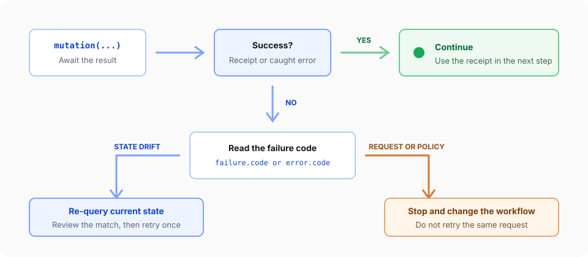

Treat every Document API mutation result as part of the operation contract. A successful receipt confirms what the engine applied. A failure receipt or rejected call explains why the workflow must stop, re-query, or change its request.

## 1. Check capabilities before acting

Capabilities describe the current document runtime. Check the operation and the requested mutation mode before presenting or running a workflow:

```ts
const capabilities = await doc.capabilities();
const replaceCapability = capabilities.operations.replace;

if (!replaceCapability.available) {
  const reasons = replaceCapability.reasons?.join(', ') ?? 'No reason reported';
  throw new Error(`Replace is unavailable: ${reasons}`);
}

if (!replaceCapability.tracked) {
  throw new Error('This document runtime cannot record replacements as tracked changes.');
}
```

Each operation capability reports `available`, `tracked`, and `dryRun`. Namespace-level flags such as `capabilities.global.trackChanges.enabled` describe broader runtime support.

A capability check is a snapshot, not a guarantee. Document state, permissions, or targets can change before the mutation runs, so always inspect the eventual result too.

## 2. Handle both failure paths

Mutations can fail in two ways:

1. The call returns a receipt with `success: false` and `failure.code`.
2. The call rejects before applying anything, for example when input validation or a revision guard fails. These errors expose a machine-readable `code` and a message.

```ts
function readErrorCode(error: unknown): string | undefined {
  if (typeof error !== 'object' || error === null || !('code' in error)) return;
  return typeof error.code === 'string' ? error.code : undefined;
}

const result = await doc.query.match({
  select: { type: 'text', pattern: 'Amazing' },
  require: 'exactlyOne',
});
const match = result.items[0];

if (!match || match.matchKind !== 'text') {
  throw new Error('The company name was not found.');
}

try {
  const receipt = await doc.replace(
    { target: match.target, text: 'Northstar' },
    { changeMode: 'tracked', expectedRevision: result.evaluatedRevision },
  );

  if (!receipt.success) {
    console.error(receipt.failure?.code, receipt.failure?.message);
    return;
  }

  console.log('Mutation applied:', receipt);
} catch (error) {
  console.error(readErrorCode(error), error);
}
```

Do not treat the absence of an exception as success. Read `receipt.success` before saving, exporting, or starting a dependent operation.



## 3. Choose recovery from the code

Use the code to select a bounded recovery path:

| Code family                                                                | Meaning                                             | Action                                                                    |
| -------------------------------------------------------------------------- | --------------------------------------------------- | ------------------------------------------------------------------------- |
| `REVISION_MISMATCH`, `STALE_REVISION`, `ADDRESS_STALE`, `TARGET_NOT_FOUND` | The document or target changed                      | Re-query current state, review the new match, and retry once              |
| `NO_OP`                                                                    | The request would not change the document           | Stop and verify whether the desired state already exists                  |
| `CAPABILITY_UNAVAILABLE`, `CAPABILITY_UNSUPPORTED`                         | The current runtime cannot perform the request      | Change the mode, operation, or runtime; do not retry unchanged            |
| `PERMISSION_DENIED`                                                        | Document policy prevents the mutation               | Keep the document unchanged and resolve authorization or protection first |
| `INVALID_INPUT`, `INVALID_TARGET`                                          | The request shape or target is invalid              | Fix the request; do not retry the same payload                            |
| `INTERNAL_ERROR`                                                           | The runtime could not complete the operation safely | Record the code and context, then stop the workflow                       |

Not every operation can return every code. Use the generated operation reference when implementing operation-specific recovery.

## 4. Retry state drift once

When a revision or target is stale, run the original query again and review its current result before retrying. Limit automatic retries to one. A repeated state-drift failure usually means another writer is active or the workflow is targeting unstable content.

Never remove `expectedRevision` just to make a retry pass. That guard prevents a valid operation from applying to an unintended document state.

<Callout variant='warning' title='Keep failures observable'>
  Log the operation name, failure code, and a safe correlation identifier. Do not log full document contents, private
  clauses, or complete mutation payloads by default.
</Callout>

Continue with [Replace and delete content](/document-api/replace-delete-content) for a complete revision-guarded example. The [generated Document API reference](/document-api/reference) lists each operation's receipt and failure codes.
