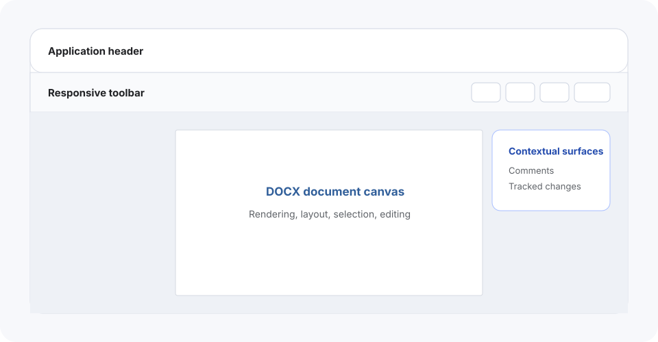

The built-in UI is the fastest path from a DOCX file to a complete editing and review experience. SuperDoc renders the document and provides the controls around it while your application owns document access, users, workflow, and persistence.

## What the built-in UI provides

The interface coordinates capabilities that otherwise require separate custom controls:

- A responsive formatting toolbar with command state.
- Document modes for editing, suggesting, and viewing.
- Comments and tracked-change review surfaces.
- Links, context menus, search, and navigation.
- Document-aware controls for content such as tables and images.
- Zoom and viewport behavior around the DOCX canvas.

The exact controls depend on the active document, selection, mode, and enabled modules. A disabled or hidden command can reflect document context rather than a missing feature.

## What your application still owns

The built-in UI does not provide document storage, authentication, or product workflow. Your application remains responsible for:

- Choosing which DOCX a person can open.
- Providing the current user and enforcing authorization.
- Deciding whether the session starts in editing, suggesting, or viewing mode.
- Saving or exporting the resulting DOCX.
- Placing the editor inside the product layout.
- Destroying the editor when that surface is removed.

Document modes control browser interaction. They are not an authorization boundary.

## Start with the complete lifecycle

Start with the [Editor quickstart](/editor/quickstart) to open, edit, and export a real DOCX. It uses the document canvas without a toolbar so the file lifecycle stays clear.

Then add the [built-in toolbar](/editor/built-in-ui/configure-the-toolbar). Comments, search, and review controls build on the same editor instance.

## Configure before replacing

If the overall experience fits, configure the built-in interface before choosing a custom UI. Common reasons include focusing the toolbar, selecting modules, setting the document mode, fitting the editor into a responsive layout, or matching product colors.

Choose a custom UI when your application needs to own the control layout, how state is presented, or a workflow that is intentionally narrower than a general document editor.

Continue with [Configure the built-in toolbar](/editor/built-in-ui/configure-the-toolbar), or learn how the [custom UI controller](/editor/custom-ui/overview) exposes the same editor state without the built-in controls.
