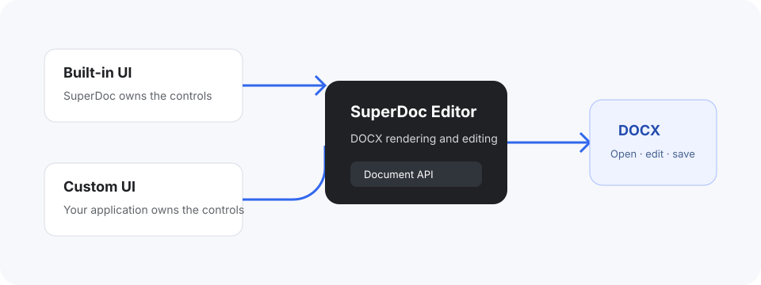

Every Editor integration uses the same DOCX engine, document lifecycle, and public Document API. The interface decision determines who renders the controls around the document.

## Three ownership modes

`Config.ui` is the single dial. Which mode you are in is a consequence of what you pass it, not a separate architecture to commit to.

| Approach     | Configuration                       | Who renders the chrome                               |
| ------------ | ----------------------------------- | ---------------------------------------------------- |
| Built-in     | Name a toolbar mount, omit the rest | SuperDoc renders its default surfaces                |
| Hybrid       | Configure selected surfaces         | SuperDoc and your application split it               |
| Fully custom | `ui: false`                         | Your application renders all of it via `superdoc.ui` |

Start with the built-in UI unless a product requirement clearly needs custom controls. It is the shortest path to a complete, accessible editing workflow, and it shows the team which interactions actually need customizing before anything is rebuilt.

Moving between modes is a configuration change. Nothing about how the document is opened, represented, or saved changes with it.

All three examples below load `/contract.docx`. Copy the [tracked-changes fixture](/fixtures/tracked-changes.docx) to your app's public directory under that name, or update the document URL.

## Built-in

Surfaces you say nothing about keep their historical defaults. The toolbar, comments, context menu, link popover, and content controls render; search and the ruler are opt-in, so add `ui: { search: true }` or `ui: { ruler: true }` when you want them.

Search is worth opting into whenever the built-in toolbar renders. The toolbar draws its Search button either way, and that button opens the find/replace surface, so leaving `search` off produces a control that is visible, enabled, and does nothing when clicked.

The one thing this mode does need is a mount target for the toolbar. SuperDoc cannot guess where in your layout that belongs, so a toolbar with nowhere to go does not render.

<include>../../../../snippets/editor/interface-built-in.html</include>

<include>../../../../snippets/editor/interface-built-in.ts</include>

Choose this for document editors, review screens, and internal workflows where the standard experience already fits. You still control document mode, the current user, integrations, theme, file lifecycle, and export.

[See the built-in UI overview](/editor/built-in-ui/overview).

## Hybrid

Most production integrations land here. Replace the one surface your product needs to own and keep the rest.

<include>../../../../snippets/editor/interface-hybrid.html</include>

<include>../../../../snippets/editor/interface-hybrid.ts</include>

The panel starts empty against the fixture above, which carries no comments. Select text and add one through your own composer, or open a DOCX that already has threads, to see it populate. [Build a custom comments UI](/editor/custom-ui/comments) covers creation, replies, and resolution on the same handle.

Each `ui` key is independent, so a partial object is additive: naming `comments` says nothing about the toolbar. Turn off only the surfaces you have actually rebuilt, because a surface you disable without replacing leaves the reader with less than SuperDoc would have given them.

This is also where the difference between rendering and permission matters most. `ui` decides what SuperDoc draws; `interaction` decides what a person may do. Your own comments panel is not bound by the built-in one's absence, so state the policy rather than inferring it.

The two comment policies answer different questions. `readOnly` refuses every write, including create, reply, and delete. `allowResolve` refuses only the resolve and reopen transition, leaving replies alone. Both default to permissive, so a panel that should not write needs `readOnly: true` said out loud.

`readOnly` reaches further than its name suggests: it also refuses tracked-change accept and reject. Their command state reports `reason: 'document-readonly'` while it is set, and direct `ui.trackChanges.accept()` or `reject()` calls return `false`. Reviewers keep reading and commenting rules but lose the ability to decide changes, so reserve it for surfaces that should not mutate the document at all rather than using it to make one comment panel non-writing.

## Fully custom

`ui: false` turns off every built-in surface at once.

<include>../../../../snippets/editor/interface-custom.html</include>

<include>../../../../snippets/editor/interface-custom.ts</include>

It removes presentation and nothing else. Editing still works, the Document API still works, `interaction` and `surfaces` still apply, and `superdoc.ui` still reports state and runs commands. That invariant is what makes a fully custom interface possible without giving up the editor underneath it.

Choose this when the surrounding experience is part of the product's differentiation: a focused contract approval screen, a form-like document workflow, or controls that must match an established design system.

`superdoc/ui` exposes a framework-neutral controller and `superdoc/ui/react` adds React providers and hooks over it. Both operate against the same active Editor and Document API.

[Understand the custom UI model](/editor/custom-ui/overview).

## Keep the lifecycle the same

Whichever mode you choose:

1. Create a `SuperDoc` editor with a DOCX and a visible container.
2. Wait for `onReady` before binding document-dependent controls.
3. Read state and run commands through public surfaces.
4. Inspect receipts for programmatic changes.
5. Export the DOCX and call `editor.destroy()` when finished. That tears down `editor.ui` with it, so destroy a controller yourself only if you built it with `createSuperDocUI()`.

<Callout title='Do not rebuild the document canvas'>
  A custom UI means you build the controls and workflow around SuperDoc. The Editor still owns DOCX rendering, layout,
  selection, and editing behavior.
</Callout>

[Configure the Editor](/editor/platform/configuration) explains how `ui`, `interaction`, and `surfaces` divide the configuration between them.
