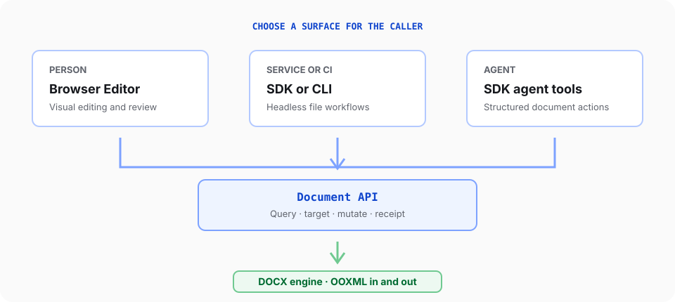

SuperDoc has one DOCX engine with several public ways to use it. Choose a surface for the caller, then use the Document API when code needs to inspect or change document content.

## Editor-specific features

The Editor is the browser surface for a person working with a document. It owns behavior that depends on a visible interface:

- Rendering paginated DOCX content in a web application
- Keyboard, pointer, and text input
- Viewing, editing, and suggesting modes
- Selection, focus, viewport, zoom, and navigation
- Built-in toolbar, comments, links, context menu, and review UI
- Custom UI built with `superdoc/ui` or `superdoc/ui/react`
- Browser file selection, export, fullscreen, and responsive layout
- Visual collaboration presence and review interactions

Use `SuperDoc` from `superdoc` in any web framework. In React, create and destroy the instance with the component
lifecycle. Use `superdoc/ui/react` when React also owns custom toolbar or panel controls.

## Headless-specific features

Headless workflows run without mounting the Editor. They own operational concerns for code, scripts, and CI:

- Opening, saving, and closing document sessions from Node.js
- Processing files in backend jobs and pipelines
- Running document operations from the command line
- Handling batches, output paths, process failures, and retries
- Comparing files or producing a DOCX for later human review
- Managing runtime installation and deployment constraints

Use `@superdoc/sdk` from Node.js or `superdoc-sdk` from Python. Use `@superdoc/cli` for shell and CI workflows.
Headless code does not have a toolbar, viewport, DOM selection, or visual review surface.

## Shared Document API features

The Document API is an operation contract, not another runtime. The browser Editor and supported headless clients expose the same operation names and data shapes.

The contract includes these feature families:

| Feature family      | Examples                                                                                                     |
| ------------------- | ------------------------------------------------------------------------------------------------------------ |
| Read and discover   | Text and node queries, extraction, document info, Markdown and HTML views                                    |
| Edit content        | Insert, replace, delete, create blocks, and clear content                                                    |
| Review              | Comments, tracked changes, history, and document diffing                                                     |
| Format              | Inline formatting, paragraph formatting, styles, lists, and tables                                           |
| Page structure      | Sections, columns, page setup, headers, footers, and page numbering                                          |
| Media               | Images, positioning, wrapping, captions, and alternative text                                                |
| Word structures     | Content controls, bookmarks, footnotes, fields, citations, cross-references, indexes, and tables of contents |
| Governance and data | Protection, permission ranges, custom XML, and anchored metadata                                             |
| File output         | DOCX export and template application                                                                         |

Support can vary by runtime, document state, mutation mode, and feature. Check `doc.capabilities()` before presenting an operation, then inspect the returned receipt or error.

The generated Document API reference remains the exhaustive list of operations and fields. Guides in this site explain how to combine those operations into reliable workflows.

## Agent-specific features

Agents use public SuperDoc surfaces rather than a separate agent-only document engine:

- `createAgentToolkit()` from `@superdoc/sdk` provides matching tool definitions, system prompts, and dispatch for product integrations.
- The same SDK runs document work without a visible editor.
- The Editor gives a person a place to review tracked output.

An agent workflow should still query current document state, target explicit content, inspect receipts, and preserve a human-review path for consequential changes.

## Choose by responsibility

| Need                                             | Start with                                                                                |
| ------------------------------------------------ | ----------------------------------------------------------------------------------------- |
| A person edits or reviews a DOCX in your product | [Editor quickstart](/editor/quickstart)                                                   |
| Backend code changes DOCX files                  | [Node.js SDK](/agents/automation/node-sdk) or [Python SDK](/agents/automation/python-sdk) |
| A shell or CI job changes DOCX files             | [CLI](/agents/automation/cli)                                                             |
| Code needs reliable document reads and mutations | [Document API mental model](/document-api/mental-model)                                   |
| Code must handle failures safely                 | [Receipts and errors](/document-api/receipts-and-errors)                                  |

Do not choose a surface by package count. Choose it by who or what is driving the document, then add only the capabilities that workflow needs.
