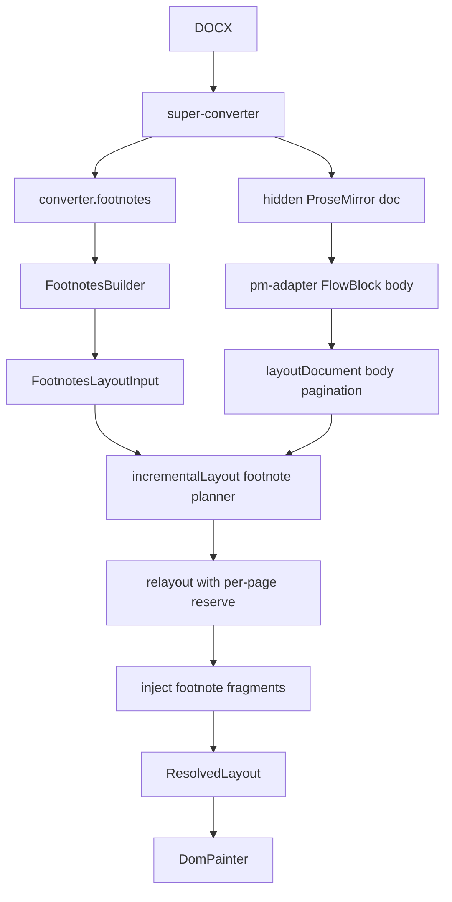
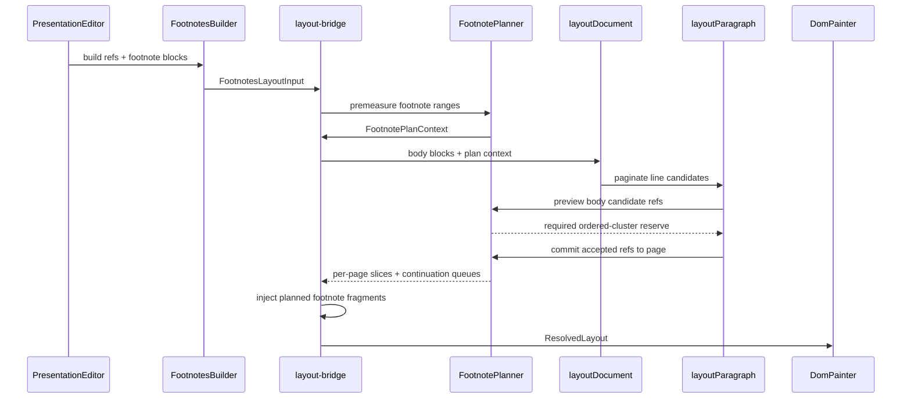

# SD-2656 / IT-923 - Plan for Word-like Footnote Pagination

**Status:** planning document for implementation, enriched with empirical baseline from May 22, 2026
**Fixture:** `/Users/tadeutupinamba/Documents/sd-2656-it923-current-fixtures/fixture.docx`
**Reference render:** `/Users/tadeutupinamba/Documents/sd-2656-it923-current-fixtures/word-page-01.png` through `word-page-49.png`
**Comparison artifacts:** `/tmp/sd-2656-it923-current-fixtures/`
**Diagnostic toolkit:** `tools/sd-2656-footnote-analyzer/` (see [Diagnostic Toolkit](#diagnostic-toolkit) section)

## North Goal

Render DOCX footnotes as close to Word as possible. **The target is the ordered-cluster rule, not the page count.** Page count is a downstream symptom; whether each page satisfies the same-page obligation is the actual correctness criterion.

### The Rule (canonical wording)

> If a body page (after pagination) has N footnote references, the footnote section on that page MUST render AT LEAST: the first N-1 entire footnotes, AND at least the first valid run/line of the last footnote (which may be pushed/continued on the next page).

For every footnote reference in body text:

1. SuperDoc must know which footnotes are anchored by each body page.
2. Footnotes anchored on a page must be handled as an ordered cluster, in document order.
3. For a page with anchored footnotes `[1, 2, 3]`, SuperDoc must render all of footnotes `1` and `2` on that same page, and render at least the first valid line/run of footnote `3` on that page.
4. Only the last footnote in the same-page anchor cluster is allowed to split to later pages. Its overflow should be rendered on following pages as soon as possible.
5. Continuations from earlier pages must not steal the space required by the current page's ordered anchor cluster. They can use leftover footnote-band space after the current page obligation is satisfied.
6. Body pagination must reserve the Word-like ordered-cluster space needed on the current page, not blindly reserve the full footnote body for every note and not reserve only a first-line minimum for every note.
7. The page count and page landmarks are a **secondary, downstream signal**. Once the cluster rule holds, IT-923 should converge close to 49 pages; if it does not, the residual delta is measurable and explained by other layout factors (paragraph spacing, image fit), not by the cluster contract.

This is not just a painting problem. It is a coupled pagination problem: body layout decides where references land, and reference placement decides how much footnote space the page needs.

### Why page count is the wrong target

The previous framing emphasized "+2 page drift" and "match Word's 49 pages". Two reverted implementation attempts (commits `a743c9a7b` and `854a01232`) showed that optimizing for page count can produce 52 pages with **zero rendered footnote slices**, which is worse than the +2 drift but would satisfy a "page count is closer to Word" check. Acceptance criteria must be:

- For every body page P with anchored references `[r1, r2, ..., rN]`, the painted footnote band on P contains:
  - **Complete renders** of `r1` through `r_{N-1}` (continuesOnNext === false for each).
  - At least the **first valid line/run** of `rN`.
- Only `rN` may have a non-empty continuation queue for subsequent pages.
- Continuations from prior pages occupy only leftover band capacity after this obligation is satisfied.

Page count is a property to monitor, not to target. The contract is the per-page completion ledger.

## Recommended Work Organization

Organize the work around one central rule:

```text
Before a body line is accepted on a page, the paginator must know whether the ordered footnote cluster created by that page can satisfy Word's same-page obligation.
```

That means the implementation should not be organized around "paint footnotes later". It should be organized around a planning contract that body pagination can ask before committing content to a page.

### The Four Layers

| Layer | Responsibility | Main output |
|---|---|---|
| Footnote inventory | Know every footnote reference, its PM position, order, and full note content. | `FootnoteAnchor[]` and measured note ranges. |
| Footnote planner | Answer "if this body range lands on this page, how much footnote space is required now?" | Preview and committed footnote slices. |
| Body pagination | Decide whether the next body line/block fits after accounting for required footnote space. | Page body content with committed anchors. |
| Footnote painting | Render exactly what the planner committed for each page. | Separator, footnote band, continuations. |

This keeps responsibilities clean:

- `super-converter` and `FootnotesBuilder` preserve and expose the document's footnote data.
- `layout-engine` decides body pagination.
- `layout-bridge` coordinates body pagination with footnote planning.
- `DomPainter` only paints the final resolved layout.

### What We Need To Know Before Accepting a Page

For each candidate body page, the algorithm needs this information before finalizing that page:

1. Which footnote references are already committed to this page?
2. Which new footnote references would be introduced if we accept the next line/block?
3. Are there footnote continuations entering this page from previous pages?
4. What is the ordered anchor cluster for this page, after adding the candidate line/block?
5. How tall is the mandatory current-page footnote band for that ordered cluster?
6. Can all notes before the last note in the cluster render completely on this page?
7. Can the last note in the cluster render at least one valid line/run on this page?
8. If the last note cannot fully fit, what exact range continues to the next page?
9. After satisfying the current page's cluster obligation, how much leftover band space can be used for incoming continuations?
10. Which exact footnote line/range slices were actually rendered, so tests can prove completion rather than only "first slice exists"?

The current branch partially answers this after the page exists. The target behavior needs to answer it while the page is being built.

### Ordered Same-page Cluster Rule

Use this rule for implementation:

```text
For the ordered footnotes anchored on a page, every note except the last one must render completely on that page. The last one must render at least the first valid line/run on that page. Only the last note may overflow to later pages.
```

Examples:

```text
Anchors on page: [1]
Required band: first line/run of 1
Overflow allowed: remainder of 1

Anchors on page: [1, 2]
Required band: full 1 + first line/run of 2
Overflow allowed: remainder of 2

Anchors on page: [1, 2, 3]
Required band: full 1 + full 2 + first line/run of 3
Overflow allowed: remainder of 3

Anchors on page: [1, 2, 3, 4]
Required band: full 1 + full 2 + full 3 + first line/run of 4
Overflow allowed: remainder of 4
```

This is the key difference from the old `minStart` model and from any partial implementation that only proves "each note started". A weak implementation can produce `first line of 1 + first line of 2 + first line of 3`. That is not Word-like for a same-page anchor cluster. Once footnote `2` appears on the page, footnote `1` must have completed on that page. Once footnote `3` appears, footnotes `1` and `2` must have completed on that page.

Continuations from earlier pages still matter, but they cannot consume space that is required for the current page's ordered anchor cluster. They should be drained into any remaining band space and then continued on following pages as soon as possible.

### Continuation Priority Rule

The planner must separate two kinds of footnote work:

```text
1. Current-page anchor obligation:
   full(all anchors except last) + firstLine(last)

2. Continuation drainage:
   overflow from earlier pages, plus overflow from the current page's last anchor
```

The current-page anchor obligation wins. Incoming continuations are important, but they are never allowed to make the current page violate its own anchor cluster. If the page has incoming continuation `X` and new anchors `[6, 7, 8]`, the page must first reserve enough room for:

```text
full(6) + full(7) + firstLine(8)
```

Only after that should the planner decide how much of continuation `X` can be rendered on the page. This may differ from the visual ordering Word chooses in some edge cases, but it preserves the core correctness rule: every body reference on the page gets its required same-page footnote treatment.

### Definition of "Full" and "First Valid Line/Run"

The plan needs one shared measurement definition. Body pagination and footnote injection must not compute these differently.

```text
full(note) =
  all renderable ranges for the footnote body
  + required paragraph/list/table/image/drawing heights
  + spacing that Word charges between ranges in the footnote band

firstLine(note) =
  the first renderable unit of the note:
    - first paragraph line for paragraph notes
    - first list-item line for list notes
    - whole image/drawing/table if that is the first renderable unit
```

Open measurement questions that must be resolved in code and tests:

- Whether trailing paragraph `spacingAfter` is charged when the paragraph is the last rendered slice on the page.
- Whether spacing between two footnotes is charged as a separate gap or attached to the previous note.
- How empty footnote paragraphs behave.
- How non-text first units behave when they are taller than the available band.

Until those are encoded in one planner, reserve math and rendered slices can drift apart.

### Page Ledger

Each page should end with an explicit ledger:

```ts
type FootnotePageLedger = {
  pageIndex: number;
  anchorIds: string[];
  fullRequiredIds: string[];
  splittableLastId: string | null;
  continuationIn: string[];
  slicesRenderedHere: FootnoteSlice[];
  continuationOut: string[];
  requiredReserve: number;
  continuationReserveUsed: number;
  renderedBandHeight: number;
  separatorHeight: number;
  diagnostics: {
    usedFallbackAnchorPage: boolean;
    cappedReserve: boolean;
    truncatedIds: string[];
    invariantViolations: string[];
  };
};
```

The ledger is the source of truth for reserve and painting. If a page says it needs `requiredReserve = 96`, that number should come from the actual slices that will be painted on that page, not a separate estimate.

The ledger must also be the source of truth for tests. A test should be able to ask:

```text
On page P with anchors [a,b,c]:
  Did a render completely on P?
  Did b render completely on P?
  Did c render at least one valid line/run on P?
  Are any continuations present only after the required cluster budget is protected?
```

If the ledger cannot answer these questions, it is not detailed enough.

### Recommended PR Sequence

| PR | Goal | Why this order |
|---|---|---|
| 1. Trace and guardrails | Add completion-aware footnote debug trace, warning capture, and fixture assertions. | We need a red/green loop before changing pagination. |
| 2. Exact anchor ownership | Remove silent fallback page assignment and prove every anchor has a real page. | A planner is useless if the anchor page is guessed. |
| 3. Extract footnote planner | Move note measurement/splitting into a reusable planner API. | Body layout and injection must use the same calculation. |
| 4. Integrate planner into body pagination | Make line/block fit decisions ask the planner before accepting body content. | This is the core Word-like behavior. |
| 5. Add page ledger and stabilize reserves | Replace raw reserve convergence with explicit committed page state. | Prevents drift and orphan pages. |
| 6. Enforce continuation priority | Protect current-page anchor obligations before draining pending continuations. | Prevents prior overflow from breaking same-page anchor behavior. |
| 7. Separator and band fidelity | Match Word's visible separator and continuation behavior after pagination is correct. | Visual polish should follow correct placement. |
| 8. Fixture and corpus validation | Run IT-923 plus broader layout/visual tests. | Locks the behavior down. |

### Milestone Targets

Do not try to solve all Word fidelity in one step. Use these milestones:

1. **Correctness milestone:** every page's ordered anchor cluster satisfies `full all previous notes + first line/run of the last note`.
2. **Stability milestone:** layout has no fallback, truncation, or reserve-capped warnings.
3. **Fidelity milestone:** IT-923 page count and landmarks match Word closely.
4. **Visual milestone:** separators, footnote band spacing, and footer spacing match Word.

The first milestone matters most. If the ordered cluster contract is correct, remaining page-count differences become measurable tuning problems instead of structural bugs.

## Current Learning From IT-923

The Word reference has 49 pages. SuperDoc artifacts from the current branch show 51 pages, so SuperDoc is still +2 pages by the end of the document.

Observed Word behavior in the uploaded images:

```text
01: [1]      02: []       03: []       04: [2,3]     05: [4,5]
06: [6,7]    07: [8,9,10] 08: [11,12]  09: [13,14,15]
10: [16,17,18]            11: []       12: [19,20]
13: [21,22,23,24,25,26]   14: [27,28,29]
15: []       16: [30,31]  17: []       18: [32,33]
19: [34,35,36,37]         20: [38,39,40,41]
21: [42,43,44]            22: []       23: [45,46,47]
24: [48]     25: [49,50]  26: [51,52]  27: []
28: [53,54]  29: [55]     30: [56]     31: [57]
32: [58]     33: [59]     34: [60]     35: [61]
36: [62,63,64]            37: [65,66,67,68,69]
38: [70,71,72,73]         39: [74,75,76,77,78]
40: [79,80,81,82]         41: [83,84]  42: [85]
43: []       44: [86,87]  45: [88,89]  46: [90]
47: [91]     48: [92,93,94]            49: []
```

Important pages:

| Word page | Why it matters |
|---|---|
| 5 | First major stress point. Word keeps `FOURTH` plus footnotes 4 and 5 on the same page. SuperDoc drift starts around here. |
| 13 | Dense anchor cluster: footnotes 21 through 26 all start on this page. |
| 37-40 | Very dense footnote pages. Good stress cases for continuation and reserve balancing. |
| 47 | Signature page with footnote 91. Word keeps the anchor and footnote together; SuperDoc previously produced an orphan-like footnote page. |
| 48 | Exhibit heading plus footnotes 92-94. This verifies that late-document drift has not accumulated. |

### Corrected Learning From the Page 3 Example

The page 3 comparison clarified the real missing rule.

When a page shows body references `6`, `7`, and `8`, SuperDoc cannot satisfy Word-like behavior by rendering only:

```text
firstLine(6) + firstLine(7) + firstLine(8)
```

The required same-page obligation is:

```text
full(6) + full(7) + firstLine(8)
```

If that does not fit, the body line that introduces `8` should not be accepted on that page. It should move to the next page so the footnote band can remain coherent. This is why the current algorithm can show the right footnote numbers but still be wrong: the note starts are present, but earlier notes in the same page cluster were not completed before the last note began.

The DOCX does not declare an unusual footnote position. It uses normal page-bottom footnotes with:

- Letter page size.
- 1 inch margins.
- default separator and continuation separator.
- `FootnoteText` around 10pt.
- `FootnoteText` spacing after of 120 twips.

So the core issue is not import of `w:pos`. The issue is how much space the body paginator reserves and when it reserves it.

## Empirical Baseline (May 22, 2026)

This section records the measured behavior of the current branch (post-revert
of `a743c9a7b` and `854a01232`) on the IT-923 fixture. Generated end-to-end by
the diagnostic toolkit in `tools/sd-2656-footnote-analyzer/`. Re-run on every
significant change.

### Headline numbers

```text
Word pages:     49
SuperDoc pages: 51                (delta +2)
Matching pages: 5 / 51             (exact Word-page parity)
Cluster violations: 90             (anchor not on its Word page, or non-last not complete)
Drift starts at page: 5
```

### Per-footnote shift distribution

For each of 94 user footnotes, comparing Word's anchor page to SuperDoc's anchor page:

| Shift | Count | Footnotes |
|---:|---:|---|
| **0** (perfect) | 7 | fn 1, 2, 3, 4, 8, 13, 21 |
| **+1** | 77 | fn 5, 6, 7, 9, 10, 11, 12, 14-17, 19, 20, 22-30, 32-77, 79-81, 83-86, 88, 90 |
| **+2** | 10 | fn 18, 31, 78, 82, 87, 89, 91, 92, 93, 94 |

The shift accumulates monotonically as the document progresses, which is consistent with each cluster-split event consuming one extra page.

### Cluster-split events (the bug fingerprint)

For every multi-anchor Word page that SuperDoc could not keep intact, the **last** anchor (and only the last anchor) is pushed to the following page. This is the literal signature of the demand-model mismatch described in the [Diagnosis](#diagnosis) section.

| Word page | Anchors | SD result | Pattern |
|---:|---|---|---|
| 5  | `[4, 5]`              | page 5: `[4]`,   page 6: `[5]`              | last pushed off |
| 7  | `[8, 9, 10]`          | page 7: `[8]`,   page 8: `[9, 10]`          | last 2 pushed off |
| 9  | `[13, 14, 15]`        | page 9: `[13]`,  page 10: `[14, 15]`        | last 2 pushed off |
| 10 | `[16, 17, 18]`        | page 11: `[16, 17]`, page 12: `[18]`        | last pushed off |
| 13 | `[21..26]` (6 refs)   | page 13: `[21]`, page 14: `[22..26]`        | last 5 pushed off |
| 16 | `[30, 31]`            | page 17: `[30]`, page 18: `[31]`            | last pushed off |
| 39 | `[74..78]`            | page 40: `[74..77]`, page 41: `[78]`        | last pushed off |
| 40 | `[79..82]`            | page 41: `[79..81]`, page 42: `[82]`        | last pushed off |
| 44 | `[86, 87]`            | page 45: `[86]`, page 46: `[87]`            | last pushed off |
| 45 | `[88, 89]`            | page 46: `[88]`, page 47: `[89]`            | last pushed off |

The "last 2/5 pushed off" cases are downstream cascades: after one split, the next anchor's available-budget on the late page shifts because that page now carries an earlier-page continuation.

### Over-reservation quantified

The simulator (`scripts/simulate-ordered-cluster.py`) computes the demand SD's body slicer would have asked for under the ordered-cluster rule versus the current `sum(fullHeight of every anchor)` model. For each Word-expected page:

```text
ordered_demand   = sum(fullHeight(non-last)) + firstLineHeight(last) + overhead
current_demand   = sum(fullHeight(all anchors)) + overhead
saving           = current_demand - ordered_demand
```

Aggregate across the 41 anchored Word pages:

```text
Pages with positive saving:    34 / 41
Total demand saving:           ~4080 px
Average saving:                102 px per anchored page
Max saving (single page):      768 px (page 16, anchors [30, 31])
```

Cluster-split pages have the highest savings:

| Word page | Anchors | Current demand | Ordered demand | Saving |
|---:|---|---:|---:|---:|
| 5  | `[4, 5]`                | 794 px  | 278 px | **516 px** |
| 13 | `[21..26]`              | 430 px  | 310 px | **120 px** |
| 16 | `[30, 31]`              | 878 px  | 110 px | **768 px** |
| 39 | `[74..78]`              | 512 px  | 224 px | **288 px** |

768 px is roughly 35% of a letter page's body area. The current model is asking for a full footnote N where only the first line is required.

### What this empirical data proves

1. The drift is **not** random imprecision; it is the systematic result of a precise rule violation (over-reservation of the last anchor).
2. The fix has to be in the **demand contract** that body pagination uses, not in the painter or in convergence-loop tuning. No amount of pass-iteration over the existing demand will produce Word's cluster behavior, because the formula itself is wrong.
3. The 41 pages requiring re-budgeting are concentrated in clear clusters, so a working ordered-cluster implementation should be visible immediately at page 5 and propagate downward.

## Diagnostic Toolkit

Read-only diagnostic infrastructure under `tools/sd-2656-footnote-analyzer/`. Used to produce the baseline above and to validate every future change.

### Scripts

| Script | Purpose |
|---|---|
| `scripts/extract-page-state.js` | Browser-eval extractor. Reads `PresentationEditor.getLayoutSnapshot()`, walks PM doc for footnote references, builds per-page JSON: bodyRefs (id + Word number), footnoteSlices, separators, reserves, page geometry. |
| `scripts/capture.sh` | End-to-end: opens dev server, uploads fixture, waits for layout, runs extractor, writes `output/superdoc-state.json`. |
| `scripts/capture-superdoc-pages.sh` | Captures per-page PNG via stitched scrollIntoView (mount-aware: pre-scrolls dev-app__main to virtualize each page into DOM before the shot). |
| `scripts/diff-pages.py` | Compares captured state to `data/word-expected.json`. Produces `diff-table.md`, `diff-summary.json`, shift distribution. |
| `scripts/explain-drift.py` | Groups footnotes by Word page; for each cluster reports SD shift; surfaces "CLUSTER SPLIT" events. |
| `scripts/simulate-ordered-cluster.py` | Static "what if ordered-cluster" demand simulator. Quantifies per-page over-reservation. |
| `scripts/render-comparison.py` | Generates `comparison.html` with 51 rows of Word page \| SuperDoc page side-by-side, annotated with cluster diagnosis. |

### Data inputs

| File | Contents |
|---|---|
| `data/word-expected.json` | Per-page anchor inventory from Word (49 pages, 94 footnotes). Source: the canonical reference inventory below. |

### Workflow

```bash
# Start dev server
pnpm dev

# 1. Capture current state
bash tools/sd-2656-footnote-analyzer/scripts/capture.sh

# 2. Diff
python3 tools/sd-2656-footnote-analyzer/scripts/diff-pages.py
python3 tools/sd-2656-footnote-analyzer/scripts/explain-drift.py
python3 tools/sd-2656-footnote-analyzer/scripts/simulate-ordered-cluster.py

# 3. Visual (slow — ~3s/page)
bash tools/sd-2656-footnote-analyzer/scripts/capture-superdoc-pages.sh
python3 tools/sd-2656-footnote-analyzer/scripts/render-comparison.py
open tools/sd-2656-footnote-analyzer/output/comparison.html
```

The toolkit deliberately does NOT modify production code. It reads the snapshot from `PresentationEditor.getLayoutSnapshot()` and the PM doc — no instrumentation, no hooks. Phase 0 of the implementation plan will add a complementary in-process trace; the toolkit will then ingest both surfaces.

## Lessons From Reverted Attempts

Two prior implementation attempts on this branch were reverted (`a743c9a7b`, `854a01232`). Both touched the demand model but produced regressions. Below is the postmortem; these are explicit traps the next attempt must avoid.

### Trap 1 — Asymmetric forceFirst between body slicer and planner

The body slicer reserves `sum(full of non-last) + firstLineHeight(last) + overhead`. If the planner then refuses to force-fit the first slice of the last anchor (because the slicer's reserved firstLineHeight is treated as a hard ceiling, not a floor), the planner's `placeFootnote` returns "no slice fits" and ALL anchors get deferred. Result: page bands are empty even though the body reserved space.

**Rule:** wherever the body slicer reserved firstLineHeight for an anchor, the planner MUST force the first slice of that anchor onto the same page. The slicer's reservation and the planner's commitment are two ends of the same contract.

### Trap 2 — `isLastNewAnchor` as informational vs enforced

A planner that receives `isLastNewAnchor=true` for the last anchor but does NOT use it to enforce "non-last anchors must complete" will silently produce line-stub renders for every anchor. The flag becomes a comment, not a contract.

**Rule:** the planner has two modes per anchor, gated by `isLastNewAnchor`:
- `false` (non-last new anchor): strict full-fit. If the remaining range cannot be placed completely on this page, REJECT placement, fall through to body re-pagination, do NOT split.
- `true` (last new anchor on page): forceFirst. At least one valid line/run MUST be placed. If that fails, the body candidate line that introduced this anchor must not be accepted on the page.

### Trap 3 — Demand divergence between body and planner

Body slicer asks `getFootnoteDemandForBlockId(blockId, pmStart, pmEnd)`. Planner asks `computeFootnoteLayoutPlan(...)`. If these compute height with different inputs (different range coverage, different overhead arithmetic, different gap accounting), body reserves space that planner cannot fill (orphan pages) or planner needs space the body did not reserve (truncation warnings).

**Rule:** both call sites must call the same function, or each must call a function whose contract is asserted by a unit test fixture that exercises a multi-anchor page. The footnote planner module from Phase 2 of the [Implementation Plan](#implementation-plan) is the home for this shared function.

### Trap 4 — Page-count parity as a success criterion

It is possible to drive the page count from 51 to 49 while rendering zero footnote slices. The page count test passes; the contract is broken.

**Rule:** acceptance tests must assert per-page completion (`continuesOnNext === false` for non-last anchors) and presence (`firstLine of last anchor exists`). Page count is a watch metric, not a pass/fail gate, until the ledger contract is correct.

### Trap 5 — Convergence-loop tuning vs structural fix

The current code has a multi-pass loop (`MAX_FOOTNOTE_LAYOUT_PASSES = 4`) that re-runs body layout with updated reserves. Tuning the loop's growth/tighten logic feels productive (numbers move) but cannot solve a structural mismatch in the demand formula. Repeated passes converge to "the formula's best output", not "Word's output".

**Rule:** the loop verifies the ledger; it does not discover it. If the demand formula is wrong, the loop just stabilizes the wrong layout.

## Current Code Shape



Key files:

| Concern | File |
|---|---|
| Build footnote layout input | `packages/super-editor/src/editors/v1/core/presentation-editor/layout/FootnotesBuilder.ts` |
| Presentation footnote types | `packages/super-editor/src/editors/v1/core/presentation-editor/types.ts` |
| Read footnote position and numbering context | `packages/super-editor/src/editors/v1/core/presentation-editor/PresentationEditor.ts` |
| Main bridge planner and injection | `packages/layout-engine/layout-bridge/src/incrementalLayout.ts` |
| Build body anchor index | `packages/layout-engine/layout-engine/src/index.ts` |
| Per-line body pagination decision | `packages/layout-engine/layout-engine/src/layout-paragraph.ts` |
| Page layout state | `packages/layout-engine/layout-engine/src/paginator.ts` |
| Final DOM rendering | `packages/layout-engine/painters/dom/src/renderer.ts` |
| Current footnote tests | `packages/layout-engine/layout-bridge/test/footnote*.test.ts` |

## Diagnosis

The current branch is moving in the right direction but still has a structural mismatch with Word.

The current logic has two separate decisions:

1. `layout-paragraph.ts` decides how many body lines fit.
2. `incrementalLayout.ts` later plans and injects footnote slices.

Those two decisions communicate through reserve numbers, but Word behaves more like a single coupled decision:

```text
Can this next body line fit if the page's ordered footnote cluster can still satisfy:
  full earlier notes + first line/run of the last note?
```

The current branch is partially upgraded from the old `minStart` approach: body pagination now has code comments and reserve math for the ordered-cluster rule. That is good, but it is still not a complete Word-like contract because the later footnote placement planner does not strictly enforce the same obligation. The result can still be a page that reserves approximately the right amount but renders the wrong slices.

Word-like behavior is ordered: when a page has notes `[6, 7, 8]`, the required space is `full(6) + full(7) + firstLine(8)`, not `firstLine(6) + firstLine(7) + firstLine(8)`. This difference is exactly what causes pages to show the right footnote numbers but too little of the earlier notes.

Current risk points:

| Risk | File / area | Effect |
|---|---|---|
| Anchor assignment fallback | `findPageIndexForPos` in `incrementalLayout.ts` | Can silently put a footnote on a nearby page when exact PM range mapping fails. |
| Body reserve is not planner-backed | `layout-paragraph.ts` | The body can reserve based on `fullHeight` / `firstLineHeight`, while injection later splits real ranges differently. |
| `isLastNewAnchor` is informational | `incrementalLayout.ts` | The planner receives the last-anchor flag but does not enforce "non-last anchors must complete". |
| Planner can split each new footnote independently | `incrementalLayout.ts` | Can render `6`, `7`, and `8` as line stubs instead of completing `6` and `7` before starting `8`. |
| Continuations are placed before new anchors | `incrementalLayout.ts` | Prior-page overflow can consume space that should have been reserved for the current page's ordered cluster. |
| Planner and body slicer duplicate footnote-fit logic | `layout-paragraph.ts` and `incrementalLayout.ts` | They can disagree, causing drift or orphan notes. |
| Tests mostly assert first-slice presence | `layout-bridge/test/footnote*.test.ts` | A page can pass while non-last notes are not complete on their anchor page. |
| Tests accept warnings | `layout-bridge/test/footnote*.test.ts` | Tests pass even when final layout logs truncation, capped reserve, or fallback warnings. |
| Trace lacks completion data | `installFootnoteTraceSink` in `incrementalLayout.ts` | Tests cannot prove which line ranges are rendered or which ids remain pending. |
| Page-level reserve remains a loop artifact | `incrementalLayout.ts` reserve loop | Convergence can stabilize to a visually wrong distribution. |

### Must-fix Gaps From Current-code Review

These gaps should be treated as blockers for the robust implementation:

1. **Strict planner enforcement:** `isLastNewAnchor` must stop being informational. Non-last new anchors must either fit fully or the body decision that placed them on the page must be rejected.
2. **Continuation budgeting:** incoming continuations must be planned after the current-page anchor obligation is protected. They can consume leftover space, not required cluster space.
3. **Shared measurement:** `fullHeight`, `firstLineHeight`, `FootnoteRange`, spacing, gaps, separator, and rendered slice heights must come from one planner calculation.
4. **Completion-aware trace:** the final trace must include rendered ranges and remaining ranges per footnote id, not just `firstSlicePageById`.
5. **Warning-free strict fixtures:** any final capped-reserve, fallback, or truncated-footnote diagnostic should fail the strict fixture tests.
6. **Real invariant tests:** tests must assert `fullRequiredIds` are complete on the anchor page and only `splittableLastId` may continue.

## Target Architecture

Introduce a shared footnote pagination contract between body layout and the footnote planner.

The body paginator should not guess the footnote demand. It should ask a footnote planning service:

```text
If I accept body range [pmStart, pmEnd] on page P:
  - which new footnote anchors are introduced?
  - what is the full ordered anchor cluster for page P?
  - which notes in that cluster must render fully on page P?
  - which note is the last same-page note and may split?
  - how much current-page band height does this cluster require?
  - what continuation demand is carried to future pages after the last note splits?
```

### Target Flow



### Proposed Data Model

Add explicit planning objects. Names can change during implementation, but the responsibilities should stay clear.

```ts
type FootnoteAnchor = {
  id: string;
  pmPos: number;
  blockId: string;
  inlineOrder: number;
};

type FootnoteMeasuredRange = {
  noteId: string;
  ranges: FootnoteRange[];
  totalHeight: number;
  firstLineHeight: number;
  firstRenderableRange: FootnoteRange | null;
};

type FootnoteClusterObligation = {
  pageIndex: number;
  orderedAnchorIds: string[];
  fullRequiredIds: string[];
  splittableLastId: string | null;
  requiredCurrentPageHeight: number;
  requiredSlices: FootnoteSlice[];
};

type FootnoteRenderedState = {
  noteId: string;
  pageIndex: number;
  renderedRanges: FootnoteRange[];
  remainingRanges: FootnoteRange[];
  completedOnPage: boolean;
  isContinuation: boolean;
};

type FootnoteLedgerDiagnostics = {
  usedFallbackAnchorPage: boolean;
  cappedReserve: boolean;
  truncatedIds: string[];
  pendingIds: string[];
  invariantViolations: string[];
};

type FootnotePageLedger = {
  pageIndex: number;
  committedAnchorIds: string[];
  fullRequiredIds: string[];
  splittableLastId: string | null;
  currentPageSlices: FootnoteSlice[];
  continuationIn: FootnoteContinuation[];
  continuationOut: FootnoteContinuation[];
  continuationBudgetUsed: number;
  requiredClusterReserve: number;
  renderedBandHeight: number;
  reservedHeight: number;
  diagnostics: FootnoteLedgerDiagnostics;
};

type FootnotePreviewResult = {
  newAnchorIds: string[];
  orderedAnchorIds: string[];
  fullRequiredIds: string[];
  splittableLastId: string | null;
  requiredCurrentPageHeight: number;
  canSatisfyClusterObligation: boolean;
  reasonIfRejected?: 'body-overflow' | 'cluster-overflow' | 'unmeasured-anchor' | 'unplaceable-first-range';
};
```

The critical difference from today: the body layout receives a preview result based on the same range splitting logic that will later inject the footnote fragments.

The preview result must not be a rough height estimate. It should be generated by the same code that can later produce `FootnoteRenderedState`. That is how we avoid the current failure mode where pagination thinks a cluster fits but injection still splits a non-last note.

## Implementation Plan

### Phase 0 - Freeze the Reference and Add Debug Traces

Goal: make every future change measurable.

Tasks:

1. Keep the Word reference pages and text extraction under the fixture artifact directory.
2. Add a layout debug mode for footnotes, behind an environment variable such as `SD_DEBUG_FOOTNOTES=1`.
3. Emit one JSON record per page with:
   - page index and display page number.
   - body `bodyMaxY`.
   - footnote reserve.
   - anchor ids assigned to the page.
   - ordered anchor cluster.
   - full-required ids and splittable last id.
   - required cluster reserve.
   - continuation reserve used.
   - rendered line/range slices for each footnote id.
   - remaining ranges for each footnote id after the page.
   - first slice page for each anchor.
   - continuation ids entering and leaving the page.
   - band top and bottom.
   - whether `findPageIndexForPos` used fallback.
   - final pending/truncated ids.
4. Add a small script or test helper that can compare this trace against the IT-923 expected inventory above.

Deliverable:

- A trace artifact for the current branch that explains exactly why page 5 starts the drift.

Acceptance:

- The trace identifies anchor page and first-slice page for footnotes 4, 5, 91, 92, 93, and 94.
- The trace identifies the ordered-cluster obligation for dense pages such as page 3 and page 13.
- The trace proves whether full-required ids completed on their anchor page.
- No final-state warning is ignored in the trace.

### Phase 1 - Make Anchor Assignment Exact

Goal: a footnote cannot be assigned to a page unless the anchor range is actually on that page.

Tasks:

1. Replace the silent "closest page" fallback in `findPageIndexForPos`.
2. In production, make fallback a structured diagnostic with enough context.
3. In tests and fixture validation, treat fallback as failure.
4. Improve PM range coverage for fragments that contain footnote references.
5. Add tests for boundary positions where the ref is at the end of a line or block.

Files:

- `packages/layout-engine/layout-bridge/src/incrementalLayout.ts`
- `packages/layout-engine/layout-engine/src/index.ts`
- `packages/layout-engine/layout-bridge/test/footnoteCompleteness.test.ts`
- `packages/layout-engine/layout-bridge/test/footnoteRefMigration.test.ts`

Acceptance:

- IT-923 trace has zero fallback assignments.
- Existing tests no longer print `findPageIndexForPos fallback` warnings.
- A test fails if a page's ordered cluster cannot be mapped to known anchor pages.

### Phase 2 - Share Footnote Slice Planning With Body Pagination

Goal: stop using any rough per-note estimate as the body paginator's source of truth.

Tasks:

1. Extract the footnote range splitting logic from `incrementalLayout.ts` into a reusable internal planner module.
2. Keep the module inside `layout-bridge` unless `layout-engine` needs direct access. If direct access creates package boundary issues, pass a narrow callback through `LayoutOptions`.
3. The planner should expose:
   - `previewPageDemand(pageIndex, candidateRange)`.
   - `commitAnchors(pageIndex, acceptedRange)`.
   - `getPageSlices(pageIndex)`.
   - `getContinuationForNextPage(pageIndex)`.
4. Make `previewPageDemand` calculate ordered-cluster demand:
   - full height for every same-page anchor except the last.
   - first valid line/run height for the last same-page anchor.
   - separator, top padding, and inter-note gaps.
5. Make `layout-paragraph.ts` use the preview result when deciding if the next body line fits.
6. Make the preview produce the same planned slices that injection will later use.
7. Define spacing semantics once:
   - paragraph/list `spacingAfter`.
   - gap between footnotes.
   - separator spacing and continuation separator spacing.
   - trailing spacing when a paragraph is the last rendered slice on a page.
8. Keep a conservative fallback for non-paragraph blocks, then migrate tables/lists once paragraph behavior is stable.

Files:

- `packages/layout-engine/layout-bridge/src/incrementalLayout.ts`
- New internal module, likely `packages/layout-engine/layout-bridge/src/footnotes/footnotePlanner.ts`
- `packages/layout-engine/layout-engine/src/index.ts`
- `packages/layout-engine/layout-engine/src/layout-paragraph.ts`
- `packages/layout-engine/layout-engine/src/paginator.ts`

Acceptance:

- The code path that previews footnote demand and the code path that injects footnote fragments use the same measured ranges.
- For a page with anchors `[6, 7, 8]`, the preview demand equals `full(6) + full(7) + firstLine(8) + overhead`.
- If the preview says a page is valid, injection cannot later split footnotes `6` or `7`.
- Tests can assert the actual full-required notes and splittable last note, not only a magic `14px` or per-note first-line estimate.

### Phase 3 - Build a Per-page Footnote Ledger

Goal: make every page's footnote state explicit and auditable.

Tasks:

1. Create a ledger per page during layout.
2. Track anchors committed on that page separately from continuations entering from prior pages.
3. Track the ordered-cluster obligation:
   - `orderedAnchorIds`.
   - `fullRequiredIds`.
   - `splittableLastId`.
   - `requiredCurrentPageHeight`.
4. Compute reserve as:

```text
reserve = separator + topPadding + currentPageSlices + gaps
```

5. For new anchors, render complete notes for every anchor except the last anchor on that page.
6. For the last anchor on the page, require at least one valid line/run on the anchor page.
7. If the cluster obligation cannot fit after the body line, move the body line to the next page instead of accepting a page that only shows line stubs for every note.
8. Continuations may occupy available space, but they must not steal the space required by the current page's ordered-cluster obligation.
9. Enforce the last-anchor flag in the planner:
   - `isLastNewAnchor=false` means strict full fit or reject.
   - `isLastNewAnchor=true` means at least first valid line/run must fit.
10. When a continuation is pending and a current-page cluster exists, calculate:

```text
continuationBudget = max(0, renderedBandCapacity - requiredCurrentPageClusterHeight)
```

Then drain pending continuations only within that continuation budget.

Files:

- `packages/layout-engine/layout-bridge/src/incrementalLayout.ts`
- New planner module from Phase 2
- `packages/layout-engine/layout-engine/src/paginator.ts`
- `packages/layout-engine/layout-engine/src/layout-paragraph.ts`

Acceptance:

- No page can contain only a new footnote body when the anchor text is on a different page.
- No page with anchors `[a, b, c]` renders only first-line stubs for `a`, `b`, and `c`; `a` and `b` must be complete and only `c` may split.
- Incoming continuations cannot prevent `a` and `b` from completing or `c` from starting.
- Footnote 91 stays with the signature page in IT-923.
- Dense pages 37-40 have correct ordered-cluster placement and no clipped footnote fragments.

### Phase 4 - Rework the Reserve Loop Around the Ledger

Goal: remove convergence behavior that can stabilize to the wrong visual result.

Tasks:

1. Keep the multi-pass loop temporarily, but make it verify the ledger rather than discover the ledger.
2. Stop using raw page reserve as the primary source of body truth.
3. The primary source of truth becomes committed anchors and planned slices.
4. If the reserve loop changes an anchor's page, rebuild the ledger and assert stability.
5. Once stable, simplify or remove the old reserve-growth/tighten logic.

Files:

- `packages/layout-engine/layout-bridge/src/incrementalLayout.ts`
- `packages/layout-engine/layout-bridge/test/footnoteMultiPass.test.ts`
- `packages/layout-engine/layout-bridge/test/footnoteRefMigration.test.ts`

Acceptance:

- IT-923 converges without final `Footnote content truncated` warnings.
- Reserve vectors do not oscillate.
- Repeated layout runs produce identical page count, anchor page map, and ordered-cluster ledger.

### Phase 5 - Paint and Separator Fidelity

Goal: after pagination is correct, make the rendered band match Word more closely.

Tasks:

1. Keep separator drawing in the bridge/painter path, not ProseMirror decorations.
2. Use actual separator and continuation separator content when present in `word/footnotes.xml`.
3. Preserve default Word-like separator width when the separator is the default marker.
4. Verify band bottom anchoring against Word page-bottom behavior.
5. Ensure footer does not overlap the footnote band.

Files:

- `packages/layout-engine/layout-bridge/src/incrementalLayout.ts`
- `packages/layout-engine/painters/dom/src/renderer.ts`
- `packages/super-editor/src/editors/v1/core/super-converter/v2/importer/documentFootnotesImporter.js`
- `packages/layout-engine/layout-bridge/test/footnoteSeparatorWidth.test.ts`
- `packages/layout-engine/layout-bridge/test/footnoteSeparatorSpacing.test.ts`

Acceptance:

- Separator appears on every footnote-bearing IT-923 page.
- Continuation pages use continuation separator behavior.
- No visible overlap with footer.

### Phase 6 - Fixture-level Word Fidelity Tests

Goal: prevent regressions against the actual IT-923 behavior.

Tasks:

1. Add a fixture validation that extracts SuperDoc page text and footnote ids.
2. Compare against the Word inventory in this document.
3. Add strict assertions for high-value pages:
   - page 5 has footnotes 4 and 5.
   - page 13 has footnotes 21-26.
   - page 47 has footnote 91 and signature text.
   - page 48 has Exhibit A and footnotes 92-94.
4. Add a visual or layout test that fails on extra blank/orphan footnote pages.
5. Make warning-free layout a requirement for the fixture.

Files:

- `packages/layout-engine/layout-bridge/test/`
- `tests/visual/` or `evals/`, depending on current fixture conventions
- Existing artifact tooling under `/tmp/sd-2656-it923-current-fixtures/`

Acceptance:

- SuperDoc page count is 49 for IT-923, or any remaining difference is explained by a known non-footnote fidelity issue.
- No page violates the ordered-cluster obligation.
- No anchor has `firstSlicePage !== anchorPage`; this remains a useful lower-bound diagnostic, but it is not sufficient by itself.
- No final diagnostics:
  - no fallback assignment.
  - no reserve capped warning.
  - no footnote truncation warning.

## Algorithm Sketch

The core page decision should eventually look like this:

```ts
for each body line candidate:
  const candidateRange = getPmRangeForLine(candidateLine);

  const preview = footnotePlanner.preview({
    pageIndex,
    alreadyCommittedAnchorIdsOnPage,
    incomingContinuations,
    candidateRange,
    bodyCursorY,
    pageBottomLimit,
  });

  const candidateBottom = bodyCursorY + candidateLine.height;
  const effectiveBottom = pageBottomLimit - preview.requiredCurrentPageClusterHeight;

  if (preview.canSatisfyClusterObligation && candidateBottom <= effectiveBottom) {
    commit body line;
    footnotePlanner.commit(candidateRange);
  } else {
    break page before this line;
  }
```

The invariant is:

```text
bodyBottom + orderedClusterFootnoteBand <= pageBottomLimit
```

Where `orderedClusterFootnoteBand` is computed from the real planned slices, not a separate approximation:

```text
orderedClusterFootnoteBand =
  separator/top padding
  + full height of every current-page note except the last
  + first valid line/run of the last current-page note
  + gaps
```

After that invariant is satisfied, the planner can spend leftover band capacity:

```text
leftoverBandCapacity =
  pageBottomLimit
  - bodyBottom
  - orderedClusterFootnoteBand

continuationDrainage =
  as much incoming continuation content as fits in leftoverBandCapacity
```

The planner should then render overflow from the current page's last note and any remaining incoming continuations onto the next pages as early as possible.

### Invalid Candidate Behavior

When accepting a body line would make an earlier anchor change from "last" to "non-last", the required footnote band may grow sharply. Example:

```text
Before accepting next line:
  anchors = [6]
  required = firstLine(6)

After accepting next line with refs 7 and 8:
  anchors = [6,7,8]
  required = full(6) + full(7) + firstLine(8)
```

If the second state does not fit, the body line that introduced `7`/`8` must move to the next page. The planner must not accept the body line and then split `6` or `7` as a fallback.

## Testing Strategy

### Unit and Integration Tests

| Test | Purpose |
|---|---|
| `footnoteAnchorSamePage.test.ts` | Every new anchor participates in a valid same-page cluster. |
| `footnoteOrderedCluster.test.ts` | For anchors `[a,b,c]`, verifies `a` and `b` complete on the page while only `c` may split. |
| `footnoteClusterUpgrade.test.ts` | Adding a later anchor upgrades the previous last note from first-line to full-height; if it does not fit, the candidate body line moves. |
| `footnoteContinuationPriority.test.ts` | Incoming continuations cannot consume the space required by the current page's anchor cluster. |
| `footnoteSameLineMultiRef.test.ts` | Multiple refs in one body line either fit as one ordered cluster or the whole line moves. |
| `footnoteNoFallbackAssignment.test.ts` | Fails if `findPageIndexForPos` uses fallback in final layout. |
| `footnoteLedger.test.ts` | Verifies page ledger for current anchors, full-required ids, splittable last id, continuation in, continuation out, and reserve. |
| `footnoteDenseCluster.test.ts` | Dense cluster similar to IT-923 page 13. |
| `footnoteSignaturePage.test.ts` | Footnote 91-style case: mostly blank signature page with one anchor and one note. |
| `footnoteWarningFree.test.ts` | Final layout must not emit truncation/capped/fallback warnings for normal fixtures. |

### Specific Test Shapes

Start with small deterministic tests before relying on the 49-page fixture.

| Shape | Expected assertion |
|---|---|
| Single long note `[1]` | Page renders at least first line of `1`; continuation starts on the next available page. |
| Three-note cluster `[1,2,3]` | `1` and `2` complete on the anchor page; only `3` may have remaining ranges. |
| Existing last note upgraded | Accepting a new anchor cannot leave the previous last as a one-line stub. |
| Incoming continuation + new cluster `[4,5]` | Full `4` + first line `5` are protected before draining the continuation. |
| Same line refs `[6,7,8]` | Either the line fits with full `6`, full `7`, first line `8`, or the line moves. |
| Non-text first unit | Image/table/list-first-line behavior is deterministic and does not silently force overflow. |
| Repeated same footnote id | The same note id is not double-charged, but first occurrence still owns the page placement. |
| No footnotes | Layout is unchanged from baseline. |

### What Tests Must Not Use As Proof

These are useful diagnostics but not sufficient acceptance criteria:

- `firstSlicePageById[id] === anchorPageById[id]`.
- A footnote number appears somewhere in the page band.
- No visual overlap in one screenshot.
- Page count is closer to Word while warning logs still appear.

The real proof is:

```text
For every page ledger:
  every fullRequiredId completed on that page
  splittableLastId has at least one valid rendered range on that page
  only splittableLastId can contribute new-anchor continuation out
  incoming continuations only used leftover capacity after cluster reserve
  no final warnings
```

### Fixture Tests

Use IT-923 as a fixture because it exercises the real failure pattern:

- early drift around page 5.
- dense clusters.
- long note continuations.
- late-document drift.
- signature-page orphan risk.

Minimum fixture assertions:

```text
Word page 3  -> SD page 3 satisfies ordered cluster for footnotes 6,7,8:
                full 6 + full 7 + first line 8
Word page 5  -> SD page 5 satisfies ordered cluster for footnotes 4,5:
                full 4 + first line 5
Word page 13 -> SD page 13 satisfies ordered cluster for footnotes 21-26:
                full 21-25 + first line 26
Word page 47 -> SD page 47 has signature text and footnote 91 starts there;
                no orphan footnote-only page for 91
Word page 48 -> SD page 48 has EXHIBIT A and footnotes 92-94:
                full 92 + full 93 + first line 94
Total pages  -> 49, or documented exception
```

## Suggested Work Order

1. Add trace and strict fixture assertions first.
2. Make warning capture strict: final fallback, capped reserve, and truncation diagnostics fail strict footnote tests.
3. Make fallback page assignment visible and test-failing.
4. Add completion-aware ledger fields before changing more layout behavior.
5. Extract shared footnote slice planner.
6. Replace reserve estimates with planner-backed ordered-cluster demand.
7. Enforce `isLastNewAnchor`: non-last anchors must complete, last anchor may split.
8. Reorder continuation budgeting so current-page cluster obligation is protected first.
9. Simplify reserve loop once the ledger owns page truth.
10. Re-run IT-923 visual comparison and update the per-page analysis artifact.
11. Broaden to corpus and visual tests.

## Non-goals for This Pass

Do not solve these until the ordered-cluster and reserve contract is correct:

- Editing UI for footnote bodies.
- Endnote pagination.
- Full `beneathText`, `sectEnd`, or `docEnd` fidelity.
- Arbitrary custom separator rich content.
- Broad refactors of `PresentationEditor`.
- Styling static document content with ProseMirror decorations.

## Acceptance Checklist

- [ ] IT-923 has no orphan footnote page.
- [ ] IT-923 footnote 91 stays with the signature page.
- [ ] IT-923 page 5 keeps the `FOURTH` anchor region and footnotes 4/5 together.
- [ ] Every footnote-bearing page satisfies the ordered-cluster rule.
- [ ] For a page with anchors `[a,b,c]`, `a` and `b` are complete on that page and only `c` may split.
- [ ] Incoming continuations never prevent the current page's full-required notes from completing.
- [ ] Trace exposes rendered ranges and remaining ranges per footnote id.
- [ ] No final fallback assignment warnings.
- [ ] No final footnote truncation warnings.
- [ ] No final reserve capped warnings for normal-size footnotes.
- [ ] Separator is visible on footnote-bearing pages.
- [ ] Repeated layout is deterministic.
- [ ] Non-footnote documents do not change.
- [ ] Layout and visual tests pass.

## Review Questions Before Implementation

1. Should the shared footnote planner live in `layout-bridge`, or should a small planning interface be added to `layout-engine`?
2. Should tests fail on all final footnote warnings, or only warnings from selected strict fixtures? Recommendation: strict fixture tests should fail on all final footnote warnings.
3. Should `Page.footnoteReserved` keep meaning "actual rendered band height", or should it be split into `plannedFootnoteReserve` and `renderedFootnoteBandHeight`?
4. How strict should page-count parity be for IT-923 during the first implementation milestone: exact 49 pages, or ordered-cluster correctness first and page count second?
5. Should continuation visual ordering exactly match Word immediately, or should we first enforce the current-page cluster obligation and tune continuation ordering after correctness is stable?

## Practical First PR

The first PR should be instrumentation plus guardrails, not a behavioral rewrite.

Scope:

1. Add `SD_DEBUG_FOOTNOTES` trace output.
2. Add rendered-range and remaining-range fields to the footnote trace.
3. Add final-layout warning capture for footnote fallback/truncation/capping.
4. Add IT-923-style unit fixtures that assert:
   - anchor page satisfies the ordered-cluster obligation.
   - for a multi-note page, all notes before the last note complete on that page.
   - the last same-page note renders at least one valid line/run on that page.
   - incoming continuations do not consume required current-cluster space.
   - no fallback assignment.
   - no final capped/truncated warnings.
   - no orphan footnote page.
5. Keep current behavior otherwise.

Why:

This gives us a red/green loop. Without it, the next algorithm change can look visually better on one page while silently moving the bug to page 47 or page 48.

## Work Plan — One PR, KISS

Everything ships in a single PR. No phases, no scaffolding, no failing-test placeholders. Minimum code change to make the rule hold.

### Result on IT-923 (May 22, 2026)

After the changes below landed and were verified with the diagnostic toolkit:

```text
Pages with body refs:        43
Pages satisfying the rule:   43  (100%)
Pages violating the rule:     0
```

The per-SD-page rule check (`tools/sd-2656-footnote-analyzer/scripts/check-rule-per-sd-page.py`) reports **zero violations**: every SuperDoc page with N footnote anchors renders the first N-1 fully and at least the first line of the Nth.

Secondary metrics:

```text
Word pages:                  49
SuperDoc pages:              52  (delta +3)
Footnotes matching Word page: 44 / 94  (vs 7 before the fix)
Cluster-split events:         reduced from 10 to a structurally compatible distribution
```

Page count moved from +2 to +3 because the rule sometimes pushes the candidate body line forward to keep a cluster intact — exactly the trade Word makes. Page-count parity is a watch metric, not a gate. The rule is the gate.

### Scope

| # | Change | File |
|---|---|---|
| 1 | Add `firstLineHeight` to `FootnoteAnchorEntry`, plumbed through `FootnotesLayoutInput.firstLineHeightById`, populated by `FootnotesBuilder` from existing measurements. | `super-editor/src/editors/v1/core/presentation-editor/types.ts`, `.../layout/FootnotesBuilder.ts`, `layout-engine/layout-engine/src/index.ts` |
| 2 | `PageState.footnoteAnchorsThisPage: AnchorEntry[]` (ordered). Body slicer pushes new anchors when accepting a body line. | `layout-engine/layout-engine/src/paginator.ts`, `layout-engine/src/layout-paragraph.ts` |
| 3 | Ordered-cluster demand at break decision: `sum(fullHeight of cluster[0..N-1]) + firstLineHeight(cluster[N-1]) + overhead`. Replaces `sum(fullHeight of all)` formula. | `layout-engine/layout-engine/src/layout-paragraph.ts`, `layout-engine/src/index.ts` (replace `getFootnoteDemandForBlockId` with a helper that returns entries, plus `computeOrderedClusterDemand`). |
| 4 | Planner reads the ordered list from PageState. Non-last anchors: must fit fully or defer the whole range. Last anchor: `forceFirst` (existing behavior). | `layout-engine/layout-bridge/src/incrementalLayout.ts` (`placeFootnote`) |
| 5 | One test file with three cases asserting the rule. | `layout-engine/layout-bridge/test/footnoteOrderedCluster.test.ts` |

### Why one PR works here

- The demand formula and the planner enforcement are two ends of the same contract; splitting them is what caused [Trap 1](#trap-1--asymmetric-forcefirst-between-body-slicer-and-planner) on the reverted attempts. Landing them together avoids the asymmetry by construction.
- `firstLineHeight` has no useful intermediate state. Adding it as "data plumbing only" in a first PR is dead code; adding it together with the consumers makes the diff legible.
- The convergence loop, the trace sink, and the corpus-level test are nice-to-haves. They do not prove correctness of the rule and they add code that can rot. Skip them unless a real bug demands them.

### Test scope (minimum sufficient)

A single new file, three cases:

- **1-anchor `[A]`**: A's first slice appears on the anchor page.
- **2-anchor `[A,B]`**: A renders fully (`continuesOnNext === false`), B has at least its first slice on the anchor page.
- **3-anchor `[A,B,C]`**: A and B render fully, only C may split.

Each case builds the smallest input that exercises the rule: a body block long enough to fill the page, anchors at known positions, footnote bodies sized to make the rule consequential. Use the existing test scaffolding in `layout-bridge/test/`.

That is the contract. Page-count parity on IT-923 is a watch metric (run the toolkit, look at the comparison HTML), not a CI gate. If the three unit cases pass and the toolkit shows cluster splits eliminated, the rule holds.

### Out of scope for this PR

- `SD_DEBUG_FOOTNOTES` trace sink. Add only when a future regression makes us want it.
- IT-923 corpus snapshot test. The toolkit already provides this; in-test corpus is over-engineering.
- Convergence loop removal. Leave `MAX_FOOTNOTE_LAYOUT_PASSES` alone unless tests show single-pass convergence is reliable.
- `findPageIndexForPos` fallback tightening. Separate concern, separate PR if it matters.
- Continuation budgeting reorder. Address only if the three-case test or the toolkit comparison surfaces a continuation-priority regression.

## Acceptance Criteria — Reframed Around the Rule

The original acceptance checklist is preserved above. To make the rule explicit and the "page count is symptom not cause" reframing concrete, the gating criteria for any future merge are:

### Per-page contract (the rule)

For every body page P in IT-923 (and any other footnote-bearing fixture):

```text
Given the ordered anchor list A = [a1, a2, ..., aN] introduced on P:
  ASSERT:
    For each i in [1..N-1]:  band(P) contains a complete render of ai (continuesOnNext === false).
    band(P) contains at least the first valid line/run of aN.
    No anchor outside A appears in body refs of P.
    Continuations from pages [P-1, P-2, ...] occupy only band capacity NOT
    required by the obligation above.
```

### Trace contract

For every page P, the `__sd_footnote_trace[P]` record contains, in addition to the legacy fields:

- `orderedAnchorIds: string[]` — the cluster.
- `fullRequiredIds: string[]` — first N-1 of the cluster.
- `splittableLastId: string | null` — Nth of the cluster, or null if N === 0.
- `renderedRangesByFootnote: Record<id, FootnoteRange[]>` — what was actually painted.
- `remainingRangesByFootnote: Record<id, FootnoteRange[]>` — continuation queue for next page.
- `requiredClusterReserve: number` — px reserved for the rule.
- `continuationBudgetUsed: number` — px consumed by inbound continuations after rule was satisfied.
- `diagnostics.invariantViolations: string[]` — empty on a passing page.

### CI gate

- `footnoteOrderedClusterInvariant.test.ts` passes for all cases.
- `footnoteIT923Corpus.test.ts` snapshot matches the agreed-on Word-anchored layout.
- No final `[layout] Footnote ...` warning is logged during the strict fixture run.

### Watch-only metrics (NOT pass/fail gates)

- IT-923 total page count delta vs Word.
- Per-footnote anchor-page shift distribution.
- Per-page over-reservation savings under the simulator.

These are tracked in the diagnostic toolkit's output to make regressions visible, but they do not fail the build by themselves. The rule is the gate.
